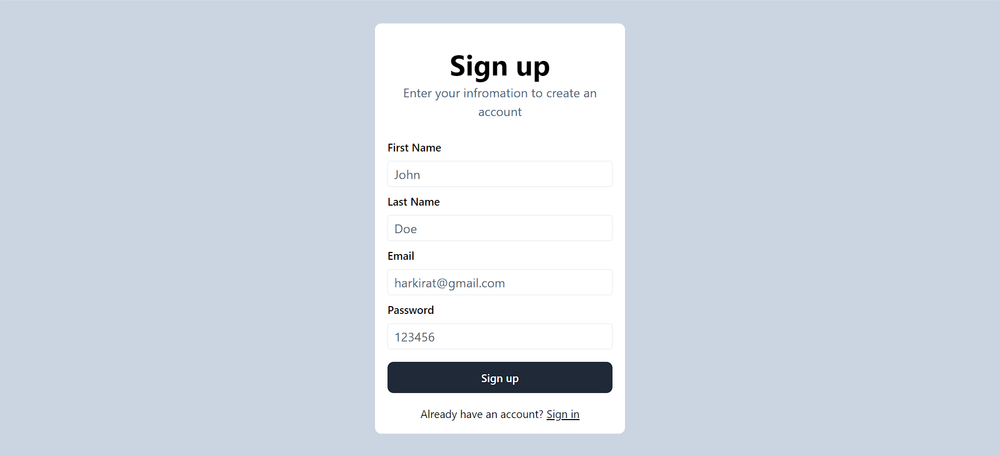
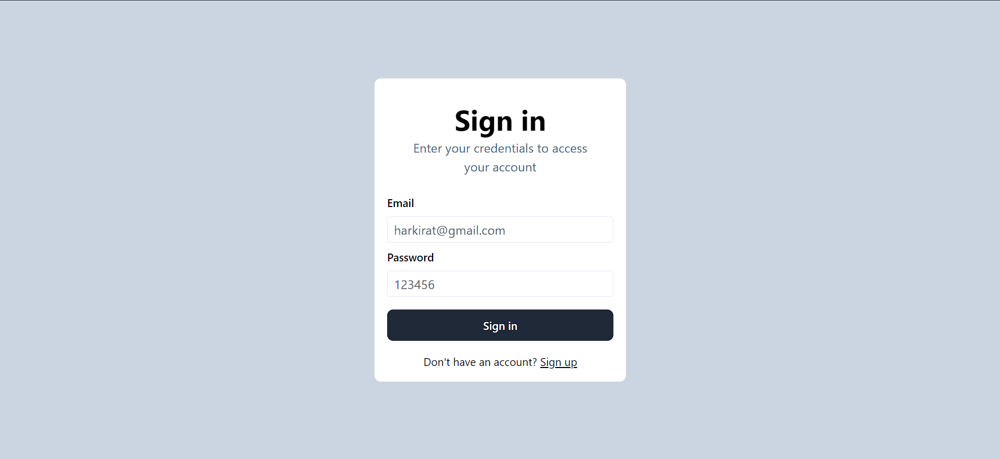
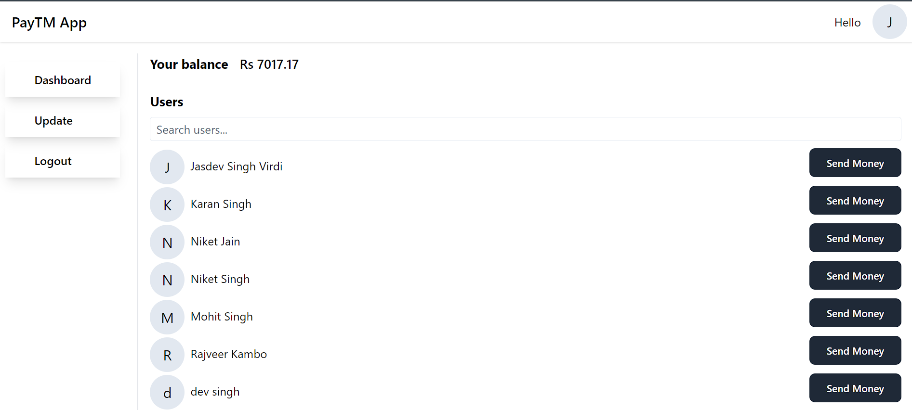
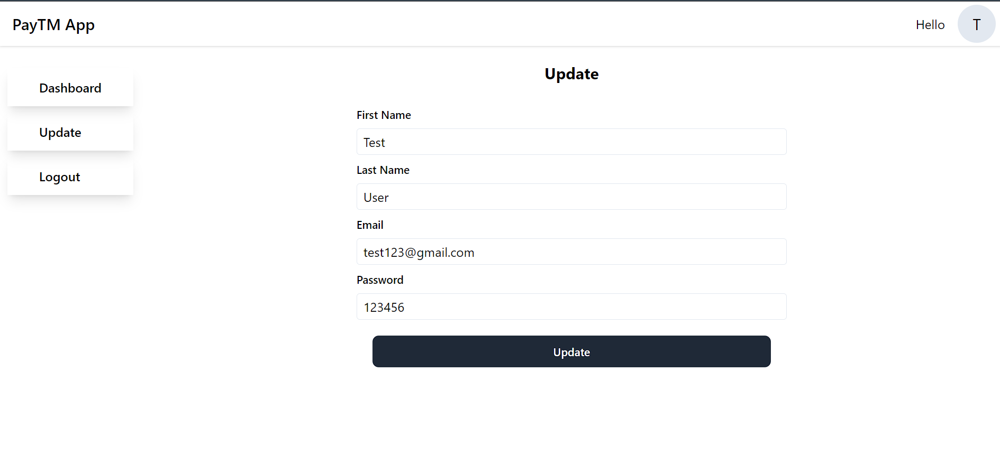
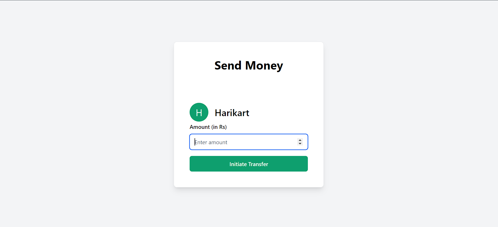
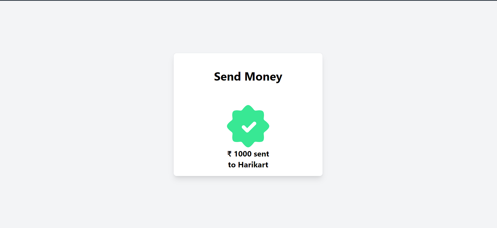

# Payments App README

## Description

This Payments App is a comprehensive solution designed to facilitate seamless financial transactions between users. It features a unique account creation process that assigns a random balance to each new account, enhancing the element of surprise and engagement for users. The app ensures a secure and efficient way of sending money, guaranteeing that transactions are either fully completed or not processed at all, thus maintaining transaction integrity.

## Features

- **Random Balance Assignment:** Each account is created with a random balance, providing an engaging start for users.
- **Secure Transactions:** Ensures that money transfers between users are executed completely or not at all, avoiding any partial transaction issues.
- **Profile Updates:** Users have the ability to update their profile information, ensuring their details are always current.
- **Authentication:** Utilizes JSON Web Tokens (JWT) for authentication, securing the app and user data effectively.
- **Protected Routing:** Implements protected routes to prevent unauthorized access to certain parts of the app, such as the dashboard.
- **Sign-in/Sign-out:** Streamlined sign-in process that directs users with a token in local storage to the sign-in page for enhanced security. Logging out clears the JWT token, ensuring user session termination.

## How to Use

1. **Account Creation:** Start by creating an account. Upon registration, you will be assigned a random balance to begin your transactions.
2. **Send Money:** Navigate to the 'Send Money' feature to transfer funds to another user. Enter the recipient's details and the amount you wish to send.
3. **Update Profile:** Access your profile settings to update your personal information as needed.
4. **Sign In/Out:** Securely sign in to access your dashboard and perform transactions. Sign out to clear your session and JWT token.

## Security Features

- **JWT Authentication:** Ensures that all user sessions are securely managed and that data transactions are protected.
- **Protected Routes:** Guards sensitive pages from unauthorized access, ensuring that users must be signed in to view certain content.
- **Transaction Integrity:** By implementing atomic transactions, the app ensures that all financial operations are reliably processed.

## Screenshots








## Installation

### Prerequisites

- Node.js installed on your local machine.
- MongoDB account for database management.

### Setup Instructions

**Frontend:**

1. Navigate to the frontend directory in your terminal.
2. Install the required dependencies by running:
   ```sh
   npm install
   ```
3. Start the frontend application in development mode by running:
   ```sh
   npm run dev
   ```

**Backend:**

1. Navigate to the backend directory in your terminal.
2. Install the required dependencies by running:
   ```sh
   npm install
   ```
3. Create a `.env` file in the root of the backend directory.
4. Inside the `.env` file, specify your MongoDB URL and the port you wish to use for the server:
   ```env
   MONGODB_URL=your_mongodb_connection_string_here
   PORT=your_preferred_port
   ```
5. Start the backend server by running:
   ```sh
   node index.js
   ```

This will set up both the frontend and backend parts of the Payments App. Ensure both the frontend and backend servers are running to use the app fully.

## Contributing

Contributions are welcome! If you have ideas for improvements or bug fixes, please follow the standard fork-and-pull request workflow. Make sure your code adheres to the existing style to maintain consistency.
